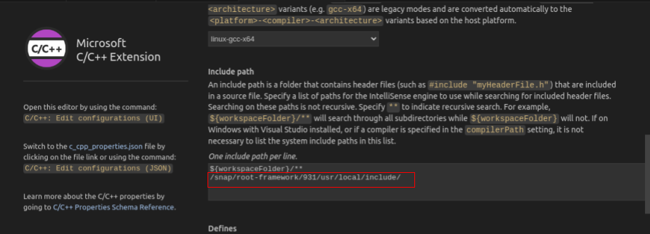
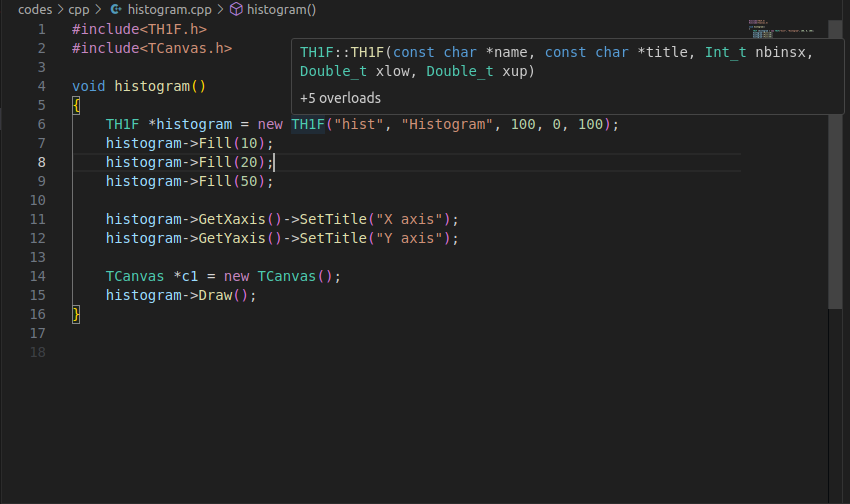
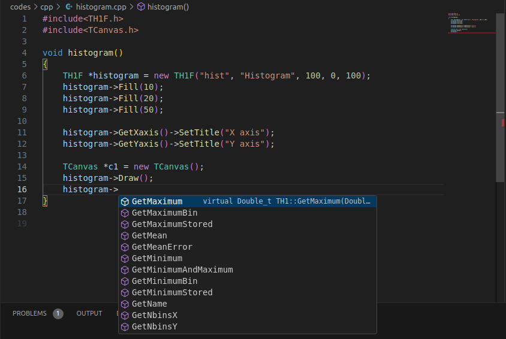
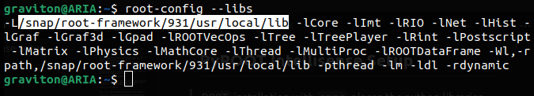

This documentation focuses solely on the setup of `ROOT` in Ubuntu with pre-compiled binary and executing `ROOT C++` programs with Visual Studio Code. 
`ROOT` can be installed either from source or from pre-compiled binary packages.
For more deatils refer to [official documentation](https://root.cern/install/).

# Install `ROOT`
On most Linux distros (tested on Ubuntu 22.04), `ROOT` can be installed with `snap` as follows:
```
sudo snap install root-framework
```

After the installation, `ROOT` CLI can be directly accessed via alias `root`. In the case of any other conflicting installations, following command can be used:
```
snap run root-framework
```

With `snap`, the installation locations are as follows:
```
Include Dir: /snap/root-framework/931/usr/local/include/
Compiler: /snap/bin/root or /snap/bin/root.exe
```

You may also find the same include files at `/snap/root-framework/current/usr/local/include/`, this is because `current` is the `symlink` of `931`.

# Setup in VS Code
Since VS Code, has many programming-friendly features such as IntelliSense, Debugger, etc., it is much convenient to use VS Code instead of traditional commandline-based editors and gedit.

## C++ Intellisense Setup
To use the `ROOT C++` libraries in VS Code you just need to set the include dir path at `Inlcude Path` in `C/C++ Configurations` as shown below:


This is a simple way to leverage the `ROOT C++` libraries with VS Code. However, there other ways to setup such as [autocompletion-with-vs-code](https://root-forum.cern.ch/t/autocompletion-with-vs-code/38188/3) and [root-on-vscode](https://github.com/AlbertoPdRF/root-on-vscode/blob/master/.vscode/launch.json).

After the setup, you will see the `IntelliSense` working as shown below.




## PyROOT Intellisense Setup
`ROOT` installation with `snap` places the python libraries at `/snap/root-framework/931/usr/local/lib/`. 


By default.
```
python3 <file_name>.py
```
doesn't recognizes the `ROOT` module. However, 
```
pyroot <file_name>.py
```
does. But the problem with using `pyroot` is you cannot use Intellisense as it is not a python interpreter. Also, VS Code doesn't recognizes the `ROOT` module. 

To fix this, in `.config>Code>User>settings.json`, I included the following fields:
```
"python.autoComplete.extraPaths": [
    "/snap/root-framework/931/usr/local/lib/"
],
"python.analysis.extraPaths": [
    "/snap/root-framework/931/usr/local/lib/"
]
```

## Installation in Mac
For installation in Mac, you can use `brew` to install `ROOT` as follows:
```
brew install root
```

For Mac, the root installation path is `/opt/homebrew/include/root/`. Add this path to the `C/C++: Include Path` in VS Code.

For PyROOT, its a little different in Mac than in Linux. You will first need to make sure that the `Python` supported by `ROOT` is the same as the `Python` you are using. Check that with
``` 
root-config --python-version
```
In the case of version mismatch, you have get error something like this:
```
>>> import ROOT
Traceback (most recent call last):
  File "<stdin>", line 1, in <module>
  File "/opt/homebrew/Cellar/root/6.32.08/lib/root/ROOT/__init__.py", line 25, in <module>
    import cppyy
  File "/opt/homebrew/Cellar/root/6.32.08/lib/root/cppyy/__init__.py", line 81, in <module>
    from ._cpython_cppyy import *
  File "/opt/homebrew/Cellar/root/6.32.08/lib/root/cppyy/_cpython_cppyy.py", line 22, in <module>
    import libcppyy as _backend
ImportError: dlopen(/opt/homebrew/Cellar/root/6.32.08/lib/root/libcppyy.so, 0x0002): symbol not found in flat namespace '_PyObject_DelAttr'
```

After you installed the same version of `Python` using `brew`, you can use the PyROOT at something like this:
```
/opt/homebrew/opt/python@3.13/bin/python3.13
```
In my case, `ROOT` Python version was `3.13.1`. 

When creating a virtual environment, if the Python inside the virtual environment doesn't link with the global Python, create a virtual environment with the global Python as follows:
```
/opt/homebrew/opt/python@3.13/bin/python3.13 -m venv venv_tct --system-site-packages
```

# Useful References
1. [C++ codes documentation](https://root.cern/doc/master/group__tutorial__hist.html)
2. [ROOT Primer](https://root.cern/primer/#interpretation-and-compilation)
3. [Tutorial for Summer Students](https://indico.cern.ch/event/395198/)
4. [Physics Matters Youtube Tutorial](https://www.youtube.com/watch?v=KPz-dNjdx40&list=PLLybgCU6QCGWLdDO4ZDaB0kLrO3maeYAe)