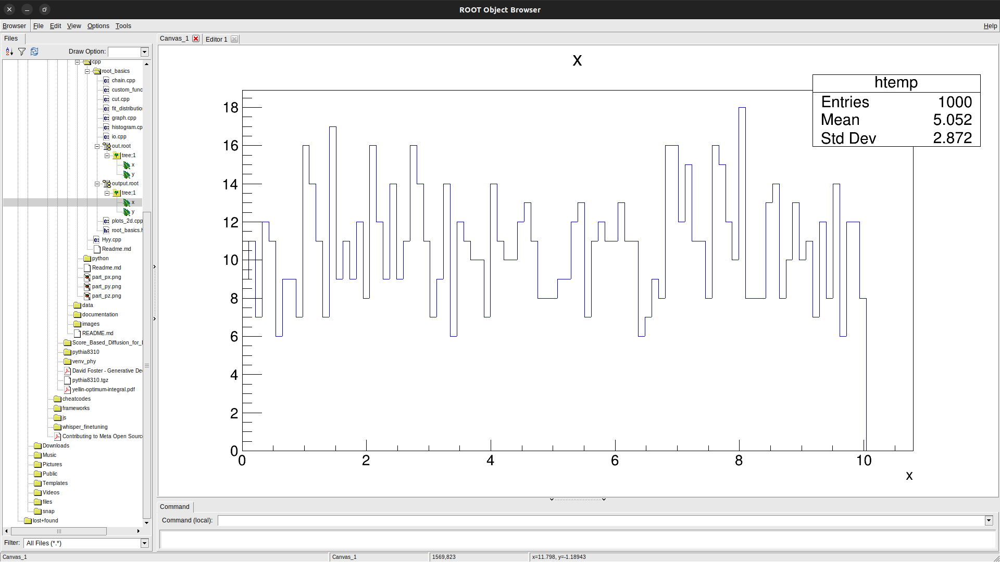

## Build Instructions
`root_basics.hpp` header file contains a `class basicFeatures` which contains the basic visualization functionlaities of ROOT library. It is not necessary to include the header `root_basics.hpp` in the `cpp` files when executing with `root` compiler (althought the backend is GNU/GCC, root has a slight different way of executing the codes).

## Histogram
```
void histogram()
{
    TH1F *histogram = new TH1F("hist", "Histogram", 100, 0, 100);
    for (int i = 0; i < 1000; i++)
    {
        histogram->Fill(gRandom->Gaus(50.0, 10.0));
    }
    
    histogram->GetXaxis()->SetTitle("X axis");
    histogram->GetYaxis()->SetTitle("Y axis");
    
    TCanvas *c1 = new TCanvas();
    histogram->Draw();
}
```


The name of the `cpp` file should be same as the function name, else the following warning may appear:
```
warning: Failed to call `histogram()` to execute the macro.
Add this function or rename the macro. Falling back to `.L`.
```
In this case, if `histogram.cpp` contains the function other than `void histogram()`, then the above warning may arise (I guess, `root` interprets our `cpp` files as macro). 

The color of the histogram can also be filled manually as,
```
hist->SetFillColor(kBlue-9);
```
where `kBlue` is an `EColor` enum. Subtraction on the enum will reduce the intensity of the color.

<table>
  <tr>
    <td> </td>
    <td></td>
   </tr> 
</table>

Detailed documentation of histogram libraries[THXX](https://root.cern/doc/master/group__Hist.html) and [tutorials](https://root.cern/doc/master/group__tutorial__hist.html).

## Graph
Detailed documentation of graph library [TGraph](https://root.cern/doc/master/classTGraph.html) and [tutorials](https://root.cern/doc/master/group__tutorial__graphs.html).

```
    TGraph *g = new TGraph(N, x, y);  
    g->SetMarkerStyle(20);
    g->SetMarkerSize(1);
```

In the code above `SetMarkerStyle` and `SetMarkerSize` is an attribute of class [`TAttMarker`](https://root.cern/doc/master/classTAttMarker.html). It contains the marker attributes such as Marker Color, Marker Style, and Marker Size.

## CLI Arguments
Command line arguments on macros such as the following,
```
void func(int N, std::string str)
{
    std::cout << N << ", " << str << std::endl;
}
```
can be passed as
```
root '<macro_finename>(<arg_int_val, "arg_str_val">)'
```

## Curve Fitting
Detailed documentation on curve fitting [TF1](https://root.cern/doc/master/classTF1.html) and [tutorials](https://root.cern/doc/master/group__tutorial__fit.html).

```
TF1 *fit = new TF1("Gauss fit", "gaus", 0, 5);
hist->Fit("Gauss fit", "Q"); //`R` => stricts the fit curve range, `Q` => quiet terminal info
```

In the above code, `"Gauss fit"` is the name of the fit and `"gaus"` is the pre-defined formula which is defined under [TFormula](https://root.cern/doc/master/classTFormula.html) class. In the `Fit` method of `TH1` class, the argument `"Q"` is a fit option for supressing the CLI output. These options are described in [TH1](https://root.cern/doc/master/classTH1.html#a7e7d34c91d5ebab4fc9bba3ca47dabdd) class.

## Legends
```
void basicFeatures::getLegends(std::map<const char *, const TObject*> legend_hashmap, Int_t border_size=4, Option_t *opt="l", Double_t xmin=0.7, Double_t ymin=0.7, Double_t xmax=0.9, Double_t ymax=0.9)
{
    TLegend *leg = new TLegend(xmin, ymin, xmax, ymax);
    leg->Draw();
    leg->SetBorderSize(border_size);
    for(auto &it:legend_hashmap)
    {
        leg->AddEntry(it.second, it.first, opt);
    }
}
```
The above method adds the legend entries taking the `TObject` and `legend name` as hash map.

## IO Operations
IO operations of `root` files are handled by [`TFile`](https://root.cern/doc/master/classTFile.html) class. The following method reads a `root` file and draws the histogram (works only for histogram `root` for now, will be modfied later to encorporate others as well).
```
void basicFeatures::readRoot(const char *rootpath, bool browse = false)
{
    TFile *file = new TFile(rootpath, "READ");
    TH1F *hist = (TH1F *)file->Get("hist");
    if (browse)
        TBrowser *browser = new TBrowser("browser", "Read Rootfile demo");
    else
        hist->Draw();
}
```
`root` files can also be directly visualized from the `Browser` leveraging the [`TBrowser`](https://root.cern/doc/master/classTBrowser.html) class.
