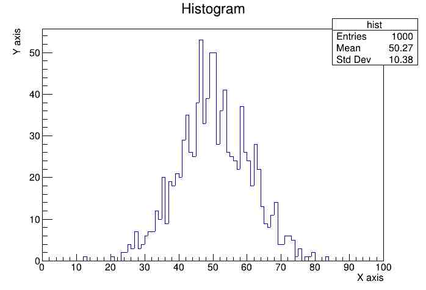
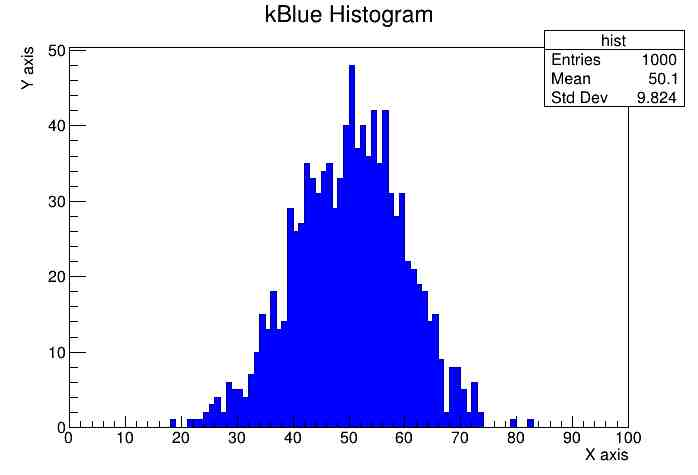

## Build Instructions
`root_basics.hpp` header file contains a `class basicFeatures` which contains the basic visualization functionlaities of ROOT library. It is not necessary to include the header `root_basics.hpp` in the `cpp` files when executing with `root` compiler (althought the backend is GNU/GCC, root has a slight different way of executing the codes).

## Histogram
```
void histogram()
{
    TH1F *histogram = new TH1F("hist", "Histogram", 100, 0, 100);
    for (int i = 0; i < 1000; i++)
    {
        histogram->Fill(gRandom->Gaus(50.0, 10.0));
    }
    
    histogram->GetXaxis()->SetTitle("X axis");
    histogram->GetYaxis()->SetTitle("Y axis");
    
    TCanvas *c1 = new TCanvas();
    histogram->Draw();
}
```


The name of the `cpp` file should be same as the function name, else the following warning may appear:
```
warning: Failed to call `histogram()` to execute the macro.
Add this function or rename the macro. Falling back to `.L`.
```
In this case, if `histogram.cpp` contains the function other than `void histogram()`, then the above warning may arise (I guess, `root` interprets our `cpp` files as macro). 

The color of the histogram can also be filled manually as,
```
hist->SetFillColor(kBlue-9);
```
where `kBlue` is an `EColor` enum. Subtraction on the enum will reduce the intensity of the color.

<table>
  <tr>
    <td> </td>
    <td></td>
   </tr> 
</table>

Detailed documentation of histogram libraries[THXX](https://root.cern/doc/master/group__Hist.html) and [tutorials](https://root.cern/doc/master/group__tutorial__hist.html).

## Graph
Detailed documentation of graph library [TGraph](https://root.cern/doc/master/classTGraph.html) and [tutorials](https://root.cern/doc/master/group__tutorial__graphs.html).

```
    TGraph *g = new TGraph(N, x, y);  
    g->SetMarkerStyle(20);
    g->SetMarkerSize(1);
```

In the code above `SetMarkerStyle` and `SetMarkerSize` is an attribute of class [`TAttMarker`](https://root.cern/doc/master/classTAttMarker.html). It contains the marker attributes such as Marker Color, Marker Style, and Marker Size.

## Curve Fitting
Detailed documentation on curve fitting [TF1](https://root.cern/doc/master/classTF1.html) and [tutorials](https://root.cern/doc/master/group__tutorial__fit.html).

```
TF1 *fit = new TF1("Gauss fit", "gaus", 0, 5);
hist->Fit("Gauss fit", "Q"); //`R` => stricts the fit curve range, `Q` => quiet terminal info
```

In the above code, `"Gauss fit"` is the name of the fit and `"gaus"` is the pre-defined formula which is defined under [TFormula](https://root.cern/doc/master/classTFormula.html) class. In the `Fit` method of `TH1` class, the argument `"Q"` is a fit option for supressing the CLI output. These options are described in [TH1](https://root.cern/doc/master/classTH1.html#a7e7d34c91d5ebab4fc9bba3ca47dabdd) class.
